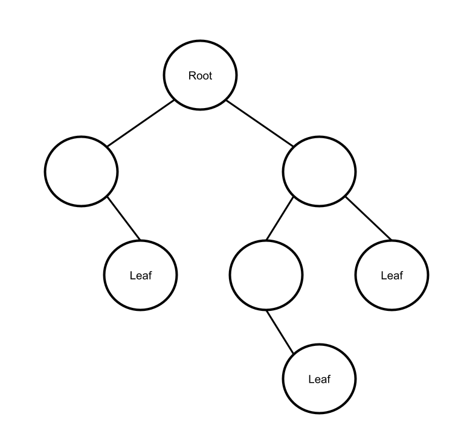
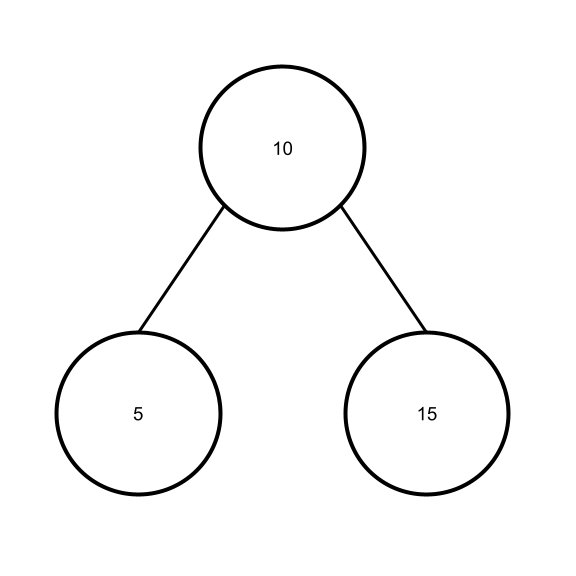

# Trees

Trees are a type of data structure comparable to Linked Lists in that both structures connect their values together as Nodes. However, Trees are different in that instead of of Nodes only ever connecting in a straight line one by one for a Linked List, the Nodes on a Tree can connect to multiple Nodes that can in turn keep branching off into more Nodes.

## Binary Trees

Binary Trees are a type of Tree in which each Node links to two Nodes at most (not counting the Node linking to them from behind). Think of these Nodes as each splitting off down into an upside-down "V" shape, which then splits off into more "V"s.

The top Node of the Tree from which all the other Nodes can trace back to is called the Root Node. The ending Nodes of the Tree to which no other Nodes connect are called the Leaf Nodes.



The Node connecting to the next two Nodes in sequence is called a Parent Node, and the Nodes branching off from it are referred to as Child Nodes. Similarly to a Linked List, it is possible for the Child Nodes to in turn connect back to the Parent Node.

By looking at all the Nodes following a specific Parent Node, you look at a Subtree of the greater overall Tree. Subtrees are often created and called in functions that help to manipulate and traverse Trees.

## Binary Search Trees

A Binary Search Tree (or a BST for short) is a type of Binary Tree that sorts itself by value, comparing new Nodes to previous Nodes to decide where to place the new Node. Values less than the current Parent Node are sent down the Tree to the left, and values greater than the Parent Node are sent down the Tree to the right. The comparison starts at the Root and continues down the Tree until reaching the end to become a new Leaf Node.

For example, consider a BST that currently has two Nodes: a Root Node with a value of 10, and splitting off to the right, a Child Node with a value of 15. If you were to add a new Node with a value of 5 to this Tree, it would be added branching off of the Root Node to the left.



## Balanced Binary Search Trees

A Balanced Binary Search Tree is a type of BST that reorganizes its data to keep the height (the amount of levels) as consistent as possible between its Subtrees. This is done through the use of certain algorithms, such as a "Red-Black Tree" algorithm or an "Adelson-Velskii and Landis" (AVL) algorithm.

Trees are usually considered unbalanced if the difference in heights between two Subtrees (that start on the same level of the tree) is greater than or equal to 2. The AVL algorithm checks Subtrees to make sure their height difference is less than 2, and if it finds that not to be the case, it detects where the issue is and allows the Tree to rearrange itself to become balanced again.

Balancing a BST is important so that the operations of the tree can be more efficient. If a Tree is too unbalanced to one side, the efficiency of adding to or removing from the specific Subtree starts changing from ```O(log n)``` to ```O(n)```, taking more time.

## Making Binary Search Trees in C#

Unlike Queues and Linked Lists, there is no basic data structure for Trees that can be imported for C#. Instead, the classes for Nodes and Trees must be implemented completely from scratch, given how variable the type and complexity of a Tree can end up being.

Creating the operation functions for Trees requires the use of recursion, or something calling itself, in a way that acts similar to a loop. Recursion is used instead of standard loops because of how Trees themselves are recursive, with Nodes having more Nodes.

However, steps must be taken to make sure that the program never finds itself in a situation where it starts overflowing through too much recursion, potentionally infinitely.

### Making Node and Tree Classes

To start making a ```Node``` class for a BST, there need to be variables for the value of the Node, the connection to the Node to the left, and the connection to the Node to the right. An example of how to declare these variables and properties can be found below:

```csharp
public class Node {
    public int Data { get; set; }
    public Node? Right { get; private set; }
    public Node? Left { get; private set; }

    public Node(int data) {
        this.Data = data;
    }
}
```

To start making the ```BinarySearchTree``` class for a BST, there needs to be a variable for the Root Node. ```System.Collections``` should also be called to allow for later methods that return the full Tree. This can be declared like so:

```csharp
using System.Collections;

public class BinarySearchTree : IEnumerable<int> {
    private Node? root;
}
```

With these classes created, the next step is to move on to adding the proper functions to each class.

### Inserting into Trees

To insert a value into a Tree, you need to add an ```Insert(value)``` function to both the ```BinarySearchTree``` class and the ```Node``` class. The ```Insert(value)``` function in the ```Tree``` class is used to both set the Root Node and, once a Root Node exists, call the ```Insert(value)``` function from the ```Node``` class.

An example of the ```Insert``` function of the ```BinarySearchTree``` class is detailed below:

```csharp
public void Insert(int value) {
    Node node = new Node(value);
    if (root is null) {
        root = node; // Assigns the new Node to the Root Node
	}
    else {
        root.Insert(value); // Calls the Node class's Insert(value) function
	}
}
```

Meanwhile, the ```Insert(value)``` function in the ```Node``` class recursively looks for the right place to put the new Node, comparing its value against the Parent Node of each new Subtree until it finds an empty Node to assign itself in place of.

An example of the ```Insert``` function of the ```Node``` class is detailed below:

```csharp
public void Insert(int value) {
	if (value == Data) {
		// Do nothing
    }
	else if (value < Data) {
		// If value is less, insert to the left
		if (Left is null) {
			Left = new Node(value);
		}
		else {
			Left.Insert(value);
		}  
	}
	else {
		// If value is greater, insert to the right
		if (Right is null) {
			Right = new Node(value);
		}
		else {
			Right.Insert(value);
		}
	}
}
```

### Traversing Trees

Traversing a Tree is going through and displaying every value in a Tree. This is best done using iterators (the ```IEnumerable<>``` class). 

The functions for traversing a Tree only need to be implimented into the ```BinarySearchTree``` class. This is best done through a set of at least three functions. In the following example code, a ```TraverseForward``` function is implemented, going through all items in the tree from smallest to largest.

```csharp
IEnumerator IEnumerable.GetEnumerator() {
    return GetEnumerator();
}

public IEnumerator<int> GetEnumerator() {
    var list = new List<int>();
    TraverseForward(root, values);
    foreach (var value in values) {
        yield return value;
    }
}

private void TraverseForward(Node? node, List<int> values) {
    if (node is not null) {
        TraverseForward(node.Left, values);
        values.Add(node.Data);
        TraverseForward(node.Right, values);
    }
}
```

By implementing the ```IEnumerator<>``` class, it allows for the Tree's values to be iterated through using ```foreach()``` loops. This allows for, for example, printing every value in the tree in numerical order.

```csharp
BinarySearchTree tree = new BinarySearchTree();
foreach (var value in tree) {
    Console.WriteLine(value);
}
```

### Efficiency of common operations

Due to the use of recursion, adding and removing from a Tree and checking if a specific value is in the Tree has a better performance than traversing the entire Tree itself, only having to traverse smaller and smaller Subtrees as it goes. Meanwhile, the operations for ```IEnumerator``` have a worse performance because they do have to traverse the entire Tree to obtain their data.

|     Operation     |                        Description                        | Performance |
|-------------------|-----------------------------------------------------------|-------------|
| insert(value)     | Insert value into tree                                    | O(log n)    |
| remove(value)     | Remove value from tree                                    | O(log n)    |
| contains(value)   | Check if value is in tree                                 | O(log n)    |
| traverse_forward  | Visit all objects small to big (IEnumerator)              | O(n)        |
| traverse_backward | Visit all objects big to small (IEnumerator)              | O(n)        |
| height(node)      | Determine height of specified node                        | O(n)        |
| size()            | Return size of tree (will often use an internal counter)  | O(n)        |
| empty()           | Return true if size is zero                               | O(1)        |

## Example Problem: Student ID Tree

In the following example, a Binary Search Tree is used to contain a list of Student IDs, and the corresponding name of each student. The user is also prompted to add additional students to the tree, and every student added is automatically sorted by ID number.

The requirements of the program are as follows:
* Students are successfully added to the Binary Search Tree, and automatically sorted by number
* Users are able to add additional students to the Tree until they wish to stop
* Invalid inputs are prevented and called out, including duplicate ID numbers

The example problem can be found here: [Example](ds3-example)

## Problem to Solve: Event Scheduling Tree

Complete the following program, which uses a Binary Search Tree to create an hourly schedule. There are classes and functions to create and manipulate the Tree and Nodes, as well as further functions to allow the user to be prompted to add additional items to the schedule.

The program is incomplete, and requires the completion of most functions. There are "TODO" comments explaining what needs to be completed where throughout the program. You should not have to create any new functions for this problem.

The program file to be completed can be found here: [Problem](ds3-problem)

Once you've finished, you may double-check against the solution here: [Solution](ds3-solution)

[Back to Welcome Page](0-welcome.md)
